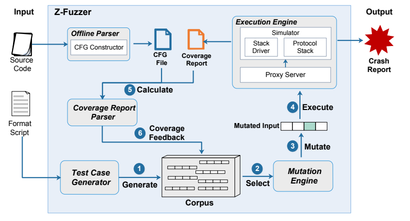

# Z-Fuzzer: Zigbee Protocol Implementation Fuzzing

Z-Fuzzer is a device-agnostic fuzzing platform to detect security vulnerabilities in Zigbee protocol implementations.

Z-Fuzzer provides a software simulation environment with pre-defined peripherals and hardware interrupts configurations to simulate Zigbee protocol execution on real IoT devices. Z-Fuzzer leverages the coverage feedback to generate more valuable test cases for fuzzing protocol implementations.

The following figure shows the workflow of Z-Fuzzer framework.


# Installation

## System Prequisites ##
```bash
* Operating System: Windows 10+.
* IAR Embedded Workbench for ARM 8.3+ (require license for usage).
* Python 2.7+. (**No Python3**).
* GCC for ARM compiler for Windows(arm-none-eabi-gcc).
* The Zigbee protocol source code for testing. We only provide an example of protocol stack driver for testing TI Z-Stack implementation. Please import the original source code files to the folder zstack_iar.
```

## Fuzzing Instructions ##
1. Parse Zigbee Cluster Library (ZCL) source code to generate original CFG information.
   
   Execute [gccarm.bat](https://github.com/zigbeeprotocol/Z-Fuzzer/tree/master/offline_parser/gccarm.bat). Replace locations of gccarm and source code of ZCL with your paths in this file.
   ```bash    
   "your\path\to\arm-none-eabi-gcc.exe" "your\path\to\zcl.c" -c -o "your\path\to\output\zcl.o" @"your\path\to\offline_parser\gccarm_extra_compile.cfg" -fdump-tree-cfg-lineno
    ```
2. Generate formatted CFG information.
    Execute [zcl_cfg_parser.py](https://github.com/zigbeeprotocol/Z-Fuzzer/tree/master/offline_parser/zcl_cfg_parser.py) with the original CFG file. It generates a JSON format file `zcl_cfg.json`.
    ```python
    python zcl_cfg_parser.py zcl.c.011t.cfg
    ```
3. Replace some hard-coded file locations with your paths.
    
    **Files for fuzzing in [lib_zstack_constants.py](https://github.com/zigbeeprotocol/Z-Fuzzer/tree/master/lib_zstack_constants.py)**
     The protocol simulator will read generated test cases from this file.
    ```bash
	- seed_file = 'your\\\\path\\\\to\\\\seedfile'. 
    ```
   The simulator will generate this coverage report for each execution. The fuzzing engine will parse this file to calculate cumulative coverage results. This path must be the same as the setting in [ZStackExecute.bat](https://github.com/zigbeeprotocol/Z-Fuzzer/tree/master/Build/ZStackExecute.bat).
    ```bash
    - coverage_file = 'your\\\\path\\\\to\\\\coverage.txt'. 
    ``` 
    The JSON format file of CFG information generated in the previous step.
    ```bash
    - cfg_file = 'your\\\\path\\\\to\\\\zcl_cfg.json'. 
    ```
    An execution script to execute Zigbee protocol from simulator.
    ```bash
    - zstack_execution = 'your\\\\path\\\\to\\\\Build\\\ZStackExecute.bat'. 
    ```
    
    **File for protocol simulation in [ZConfig.h](https://github.com/zigbeeprotocol/Z-Fuzzer/tree/master/zstack_iar/ZMain/ZConfig.h)**
    ```C
    static char* seedfile = "your\\\\path\\\\to\\\\seedfile"; // Must be the same as the above
    ```
4. Start fuzzing.
    
    Run the proxy server first.
    ```python
    python zfuzzer_proxy_server.py
    ```
    Run the fuzzing enginer.
    ```python
    python zfuzzer_fuzzing_zigbee.py
    ```

# Discovered Vulnerabilities

Z-Fuzzer has discovered three new CVEs in Texas Instruments Zigbee protocol implementation Z-Stack. See more details under [vulnerabilities](vulnerabilities)

|   | Vulnerabilities | Severity | Protocol Version | Impact Type |
| - |----------|-----------------|---------|--------------------|
|[CVE-2020-27890](https://nvd.nist.gov/vuln/detail/CVE-2020-27890)| Improper Input Validation | High 8.2 | Z-Stack 3.0.1 | Non-compliance |
|[CVE-2020-27891](https://nvd.nist.gov/vuln/detail/CVE-2020-27891)| Improper Input Validation | High 7.5 | Z-Stack 3.0.1 | Crash |
|[CVE-2020-27892](https://nvd.nist.gov/vuln/detail/CVE-2020-27892)| Improper Memory Allocation | High 7.5 | Z-Stack 3.0.1 | Crash |
